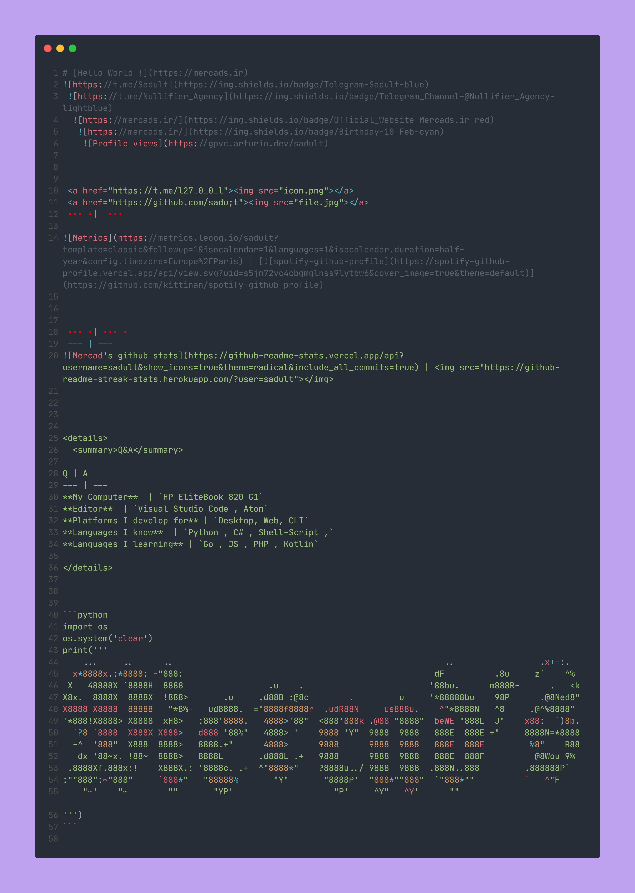

# [Hello World !](https://mercads.ir)

 
  
   
    
    
    
    
 <a href="https://t.me/l27_0_0_l"></a>
 ‏‏‎ ‎|  ‏‏‎ 

 | [](https://github.com/kittinan/spotify-github-profile)


 ‏‏‎ ‎| ‏‏‎ ‎
 --- | ---
 | </img>


<details>
  <summary>Q&A</summary>

Q | A
--- | --- 
**My Computer**  | `HP EliteBook 820 G1`
**Editor**  | `Visual Studio Code , Atom`
**Platforms I develop for** | `Desktop, Web, CLI`
**Languages I know**  | `Python , C# , Shell-Script ,`
**Languages I learning** | `Go , JS , PHP , Kotlin`

</details>


```python
import os
os.system('clear')
print('''
    ...     ..      ..                                                      ..                 .x+=:.   
  x*8888x.:*8888: -"888:                                                  dF          .8u     z`    ^%  
 X   48888X `8888H  8888                 .u    .                         '88bu.      m888R-      .   <k 
X8x.  8888X  8888X  !888>       .u     .d88B :@8c        .         u     '*88888bu    98P      .@8Ned8" 
X8888 X8888  88888   "*8%-   ud8888.  ="8888f8888r  .udR88N     us888u.    ^"*8888N   ^8     .@^%8888"  
'*888!X8888> X8888  xH8>   :888'8888.   4888>'88"  <888'888k .@88 "8888"  beWE "888L  J"    x88:  `)8b. 
  `?8 `8888  X888X X888>   d888 '88%"   4888> '    9888 'Y"  9888  9888   888E  888E +"     8888N=*8888 
  -^  '888"  X888  8888>   8888.+"      4888>      9888      9888  9888   888E  888E         %8"    R88 
   dx '88~x. !88~  8888>   8888L       .d888L .+   9888      9888  9888   888E  888F          @8Wou 9%  
 .8888Xf.888x:!    X888X.: '8888c. .+  ^"8888*"    ?8888u../ 9888  9888  .888N..888         .888888P`   
:""888":~"888"     `888*"   "88888%       "Y"       "8888P'  "888*""888"  `"888*""          `   ^"F     
    "~'    "~        ""       "YP'                    "P'     ^Y"   ^Y'      ""                                               
''') 
```

 <a href="https://github.com/sadu;t"></a>
